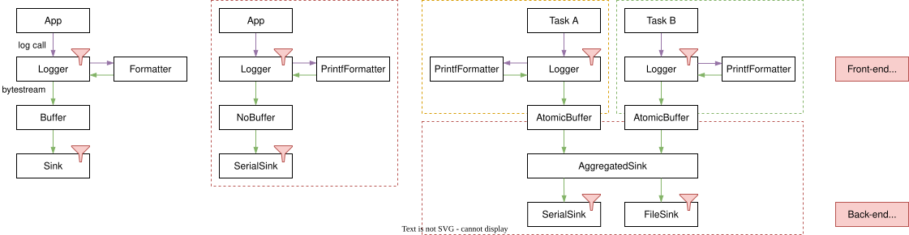

Advanced Filtering
==================

There are 3 settings in the log library where filtering applies:

.. list-table::
   :header-rows: 1
   :widths: 15 15 40

   * - Setting
     - Filtering
     - Reason
   * - ``log_conf::MAX_LOG_LEVEL`` (Global)
     - ``LogLevel``
     - Limit overhead from logging on binary (performance and binary size).
   * - ``LogContext``
     - ``LogLevel``, ``LogMetadata``
     - Limit amount of logs produced into a buffer (buffer overflow and size).
   * - ``LogSink``
     - ``LogLevel``, ``LogMetadata``
     - Limit amount of logs sent into a sink (data size and throughput).

As shown in the figure below every ``Logger`` instance uses its context to send log messages.
Note that there can be multiple ``Logger`` instances attached to one context.

Every ``LogSink`` can then again filter the messages from the buffers.
Let us consider a device which logs to serial port and and SDcard.
The serial port is used for development purposes and pass all messages.
While we can only store the most important messages on the SDcard due to space limitations.

    Filtering overview

Level-based Filtering
---------------------

The context and sink filters can be accesses through the ``LogRegistry``.
The filter can be set to a ``LogLevel``:

.. code-block:: cpp
    :caption: main.cpp

    logRegistry->getContext(MyLogContext::THREAD_A).setLogLevel(se_oss::LogLevel::INFO);
    logRegistry->getSink(MyLogSink::FILE).setLogLevel(se_oss::LogLevel::ERROR)

Function-based Filtering
------------------------

Alternatively, a filter function that receives the ``LogMetadata`` can be registered:

.. code-block:: cpp
    :caption: main.cpp

    logRegistry->getContext(MyLogContext::CELLULAR).setFilter( -> bool {
        return metadata.level >= se_oss::LogLevel::INFO && metadata.loggerTag == 42U;
    });

In addition to ``LogLevel`` the metadata contains the logger and context tags for finer logging.

Tagged Logging
--------------

Every logger instance and every context can be assigned a tag.
The tags are part of the ``LogMetadata`` with intention of fine tuned filtering.

For example in complex application the trace level is rarely usable as log messages easily flood the buffers and communication interface.
When each log message is traceable to its producer the user can enable trace level only the software components their interested in.

Or if a bug is reported you can selectively collect more information about the suspected software components even with limited communication/storage throughput.
