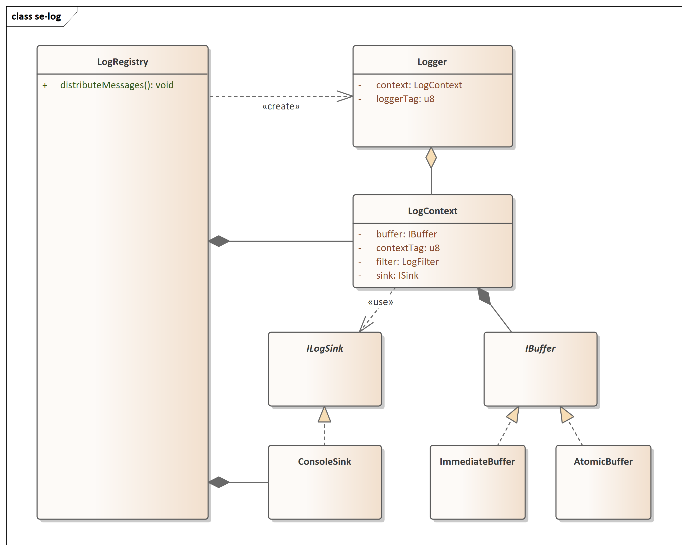

Getting Started
===============

.. _minimal_setup:

Minimal Setup
-------------

Add the ``se-oss`` repository to your CMake project and link against the ``se_oss::log`` library:

.. code-block:: cmake
    :caption: CMakeLists.txt

    cmake_minimum_required(VERSION 3.28)

    set(SE_OSS_COMPONENT_LOG ON CACHE BOOL "" FORCE)
    include(FetchContent)
    FetchContent_Declare(
            se_oss
            GIT_REPOSITORY https://github.com/sourceengineers/se-oss.git
            GIT_TAG        v1.0.0
    )
    FetchContent_MakeAvailable(se_oss)

    add_executable(my_app main.cpp)
    target_link_libraries(my_app PRIVATE se_oss::log)

The log library provides a default configuration which formats messages in prinf-style and writes them immediately to ``stdout``.
The following example demonstrates the log interface:

.. code-block:: c++
    :caption: main.cpp

    #include <se-oss/log/Log.h>
    #include <se-oss/log/LogRegistry.h>

    int main() {
        auto logRegistry = std::make_unique<se_oss::LogRegistry<>>();
        auto log = logRegistry->createLogger(se_oss::DefaultLogContext::DEFAULT);

        LOG_TRACE(log, "A trace message");
        LOG_DEBUG(log, "Link state has changed to %d", -1);
        LOG_INFO(log, "You can use printf-style formatting %u", 42U);
        LOG_WARN(log, "This is the last warning!");
        LOG_ERROR(log, "Could not switch relay, current state=%u", 0U);
        LOG_FATAL(log, "External memory has been disconnected! Restarting device...");
    }

.. note::
    The default logger is not thread-safe.

The expected output on ``stdout`` is:

.. code-block:: text
    :caption: Console Output

    2026-05-05T12:38:17.677Z T [default] -- A trace message
    2026-05-05T12:38:17.677Z D [default] -- Link state has changed to -1
    2026-05-05T12:38:17.677Z I [default] -- You can use printf-style formatting 42
    2026-05-05T12:38:17.677Z W [default] -- This is the last warning!
    2026-05-05T12:38:17.677Z E [default] -- Could not switch relay, current state=0
    2026-05-05T12:38:17.677Z F [default] -- External memory has been disconnected! Restarting device...

.. note::
    Formatting is fully configurable. You can choose different printf-style formatting options or implement your own variant altogether. See :ref:`configuration`.

Multi-Threaded Setup
--------------------

The default log configuration just supports one log context and immediate formatting.
For thread-safe logging we switch to buffered logs. There is one log buffer per thread.
A collector thread can then read all message from the buffers and distribute them to the sink.

In our main file we add the ``LogConf`` function specialization and select the ``PrintfFormatter`` and ``AtomicBuffer``.
The ``AtomicBuffer`` provides a thread-safe interface between the threads producing log messages and the collector distributing messages.
The logger configuration is documented in :ref:`configuration`.

.. code-block:: c++
    :caption: main.cpp Configuration Extract

    constexpr std::size_t LOG_BUFFER_SIZE {2048U};
    constexpr std::size_t LOG_MAX_MESSAGE_LENGTH {128U};
    template<>
    auto se_oss::logConf<>()
    {
        return LogConf<PrintfFormatter<TimeFormat::ISO8601>, AtomicBuffer<LOG_BUFFER_SIZE>, LOG_MAX_MESSAGE_LENGTH> {};
    }

The ``LogRegistry`` is a support class that holds ownership of all log contexts and sinks.
The registry serves as the single provider of objects related to logging in order to prevent a sea of objects.
In the registry design the assumption was made, that all log contexts and sinks are known at compile time (which is normally the case on a microcontroller).
An enumeration is used to access contexts and sinks because it is strongly typed and efficient at run time.

In this example we will use two threads and one sink:

.. code-block:: c++
    :caption: main.cpp Registry Extract

    enum class LogContextId
    {
        ThreadA,
        ThreadB,
    };

    constexpr const char* toString(const LogContextId id)
    {
         switch (id) {
            case LogContextId::ThreadA: return "a";
            case LogContextId::ThreadB: return "b";
            default: return "unknown";
        }
    }

    enum class LogSinkId
    {
        Console,
    };

We can then use the enumerations to create the registry.
The methods to access the sinks and loggers then use those enumerations.
That is useful for example when we would like to change a filter setting of context after the setup phase.

.. code-block:: c++
    :caption: main.cpp Log Registry Extract

    int main() {
        auto logRegistry = std::make_unique<se_oss::LogRegistry<LogContextId, LogSinkId>>();
        logRegistry->attachSink(LogSinkId::Console, std::make_unique<se_oss::ConsoleSink>());
        auto logA = logRegistry->createLogger(LogContextId::ThreadA);
        // [..]
    }

The last thing we need are a few threads to log messages in various contexts and collect them at another point.
The listing below contains the complete multi-threaded example code.

.. code-block:: c++
    :caption: main.cpp

    #include <se-oss/log/Log.h>
    #include <se-oss/log/LogRegistry.h>
    #include <se-oss/log/sink/ConsoleSink.h>
    #include <se-oss/log/sink/FilteredSink.h>
    #include <thread>

    enum class LogContextId
    {
        ThreadA,
        ThreadB,
    };

    constexpr const char* toString(const LogContextId id)
    {
         switch (id) {
            case LogContextId::ThreadA: return "a";
            case LogContextId::ThreadB: return "b";
            default: return "unknown";
        }
    }

    enum class LogSinkId
    {
        Console,
    };

    int main() {
        auto logRegistry = std::make_unique<se_oss::LogRegistry<LogContextId, LogSinkId>>();
        logRegistry->attachSink(LogSinkId::Console, std::make_unique<se_oss::ConsoleSink>());

        auto logA = logRegistry->createLogger(LogContextId::ThreadA);
        auto logB = logRegistry->createLogger(LogContextId::ThreadB);

        std::thread threadA {[=]() mutable {
            for (size_t i = 0; i < 5; ++i) {
                LOG_INFO(logA, "Hello from thread a.");
                std::this_thread::sleep_for(std::chrono::milliseconds(5));
            }
        }};
        std::thread threadB {[=]() mutable {
            for (size_t i = 0; i < 5; ++i) {
                LOG_INFO(logB, "Hello from thread b.");
                std::this_thread::sleep_for(std::chrono::milliseconds(10));
            }
        }};
        std::thread distributor {[&]() {
            for (size_t i = 0; i < 5; ++i) {
                logRegistry->distributeMessages();
                std::this_thread::sleep_for(std::chrono::milliseconds(20));
            }
        }};

        threadA.join();
        threadB.join();
        distributor.join();
    }

The expected output on ``stdout`` is:

.. code-block:: text
    :caption: Console Output

    2026-05-05T14:26:08.100Z I [b] -- Hello from thread b.
    2026-05-05T14:26:08.112Z I [b] -- Hello from thread b.
    2026-05-05T14:26:08.100Z I [a] -- Hello from thread a.
    2026-05-05T14:26:08.107Z I [a] -- Hello from thread a.
    2026-05-05T14:26:08.112Z I [a] -- Hello from thread a.
    2026-05-05T14:26:08.118Z I [a] -- Hello from thread a.
    2026-05-05T14:26:08.123Z I [b] -- Hello from thread b.
    2026-05-05T14:26:08.133Z I [b] -- Hello from thread b.
    2026-05-05T14:26:08.123Z I [a] -- Hello from thread a.
    2026-05-05T14:26:08.143Z I [b] -- Hello from thread b.

.. note::
     The log messages in the output are not necessarily in timestamp order as the log buffers are drained one context after another.

Software Design
---------------

    Software design overview for se-log.

The figure above shows the simplified design of the classes implemented in the log library.
The ``LogRegistry`` serves a helper class declaring clear ownership of the objects created for logging.

The log front-end requires ``Logger`` instance.
Multiple of those instances can reference a shared ``LogContext``.
The context is owner of the buffer used for logging. For multi-threaded applications there should be one context per thread.
The context knows a sink so that messages can be distributed.
