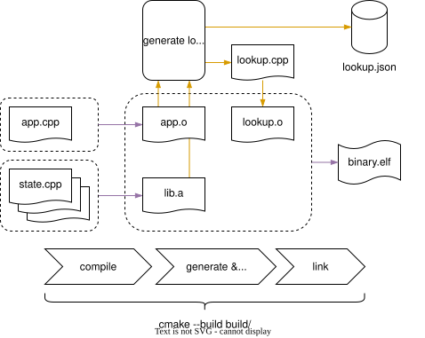

.. _string_replacement:

String Replacement
==================

Log format strings can take up a lot of space on the target non-volatile memory or hit the throughput limit on the communication interface.
The solution provided here replaces format strings with their hashes at compile time.

Please note that string replacement comes at a cost:

* Tools and lookup table are required to interpret log messages
* Lookup table must match binary revision. The tool here uses string hashes as ID so that in the case of a slight version mismatch, most strings IDs still match.
* Templates are used to replace strings at compile time which will increase compile time and string length is limited by the compilers template capabilities.

.. code-block:: c++
    :caption: UserLogConf.h

    // [..]
    #define SE_OSS_LOG_REPLACE_STRINGS
    // [..]

You will need also to enable string replacement for your target in CMake so the string lookup table is generated:

.. code-block:: cmake

    include(${se-oss_SOURCE_DIR}/cmake/resource_database.cmake)
    se_create_resource_database(TARGET my_application)

With this option enabled format strings will be replaced at compile time with ``u32`` hash values.
This reduces the size of the binary and throughput requirements.
During the build process a table of all format strings will be generated in the binary directory.
On the host side a tool is required to translate the id back to format strings and apply the log arguments.

String replacement is usually applied together with a binary formatter (e.g. ``CborFormatter``).

Replacement Process
-------------------

    Resource replacement in the build process.

String replacement uses ``nm`` and a simple python script to generate and compile the string loop up file in a normal CMake build.

Let us consider this simple example:

.. code-block:: c++
    :caption: main.cpp

    LOG_DEBUG(log, "Link state has changed to %d", -1);

The log macro will expand into:

.. code-block:: c++
    :caption: LOG_DEBUG macro expansion (simplified)
    :emphasize-lines: 3

     log.log(
        se_oss::LogLevel::DEBUG,
        getResourceId<ResourceIdentifier<76, 105, 110, 107, 32, 115, 116, 97, 116, 101, 32, 104, 97, 115, 32, 99, 104, 97, 110, 103, 101, 100, 32, 116, 111, 32, 37, 100, 0>>(),
        -1
     );

The format string has been replaced by template specialization of ``getResourceId<>()`` which return a ``u32`` hash.
So, the binary contains function calls that can be optimized away instead of strings.
The replacement is done by the compiler and templates. No special tooling or non-standard C++ is used.

But at this moment these ``getResourceId<>()`` specializations do not exist. They are undefined symbols.
When the compiler is done we can find all undefined ``getResourceId<>()`` symbols using ``nm``, generate and compile their definition ad-hoc.
In the next step, the linker is called as usual.

In this example the generated file will contain:

.. code-block:: c++
    :caption: SeResourceDatabase.cpp

    #include "se-oss/log/ResourceDatabase.h"

    namespace se_oss {
    //! Get ID for string 'Link state has changed to %d'
    template<>
    uint32_t getResourceId<ResourceIdentifier<76, 105, 110, 107, 32, 115, 116, 97, 116, 101, 32, 104, 97, 115, 32, 99, 104, 97, 110, 103, 101, 100, 32, 116, 111, 32, 37, 100, 0>>() { return 0x27B728F9; }
    }

In addition to source file which is needed for the binary compilation, the script outputs a lookup JSON which is used to map the hash values back to the format strings.
The ``revision`` identifier ensures traceability between lookup database and binary.

.. code-block:: json
    :caption: se_log_resource_database.json

    {
      "revision": {
        "git-hash": "1bc6bd4",
        "dirty": true
      },
      "resources": {
        "666315001": "Link state has changed to %d"
      }
    }

For the example log message stated at the beginning the resulting output message using the ``CborFormatter`` will be:

.. code-block:: text
    :caption: CBOR output hex string

    A6011B0006522AB6BDEF0F020103000418FF061A27B728F9078120
    ---
    A6                     # map(6)
       01                  # unsigned(1)
       1B 0006522AB6BDEF0F # unsigned(1779193268268815)
       02                  # unsigned(2)
       01                  # unsigned(1)
       03                  # unsigned(3)
       00                  # unsigned(0)
       04                  # unsigned(4)
       18 FF               # unsigned(255)
       06                  # unsigned(6)
       1A 27B728F9         # unsigned(666315001)
       07                  # unsigned(7)
       81                  # array(1)
          20               # negative(0)

In comparison to the printf output would be:

.. code-block:: text
    :caption: Printf output string

    2026-05-19T12:24:51.750Z D [cell] -- Link state has changed to -1

The message using string replacement and CBOR is smaller, just using 27B instead of 65B (printf baseline).
But the CBOR message also carries more information: log and context tags are still present, timestamp is in microseconds instead of milliseconds.
